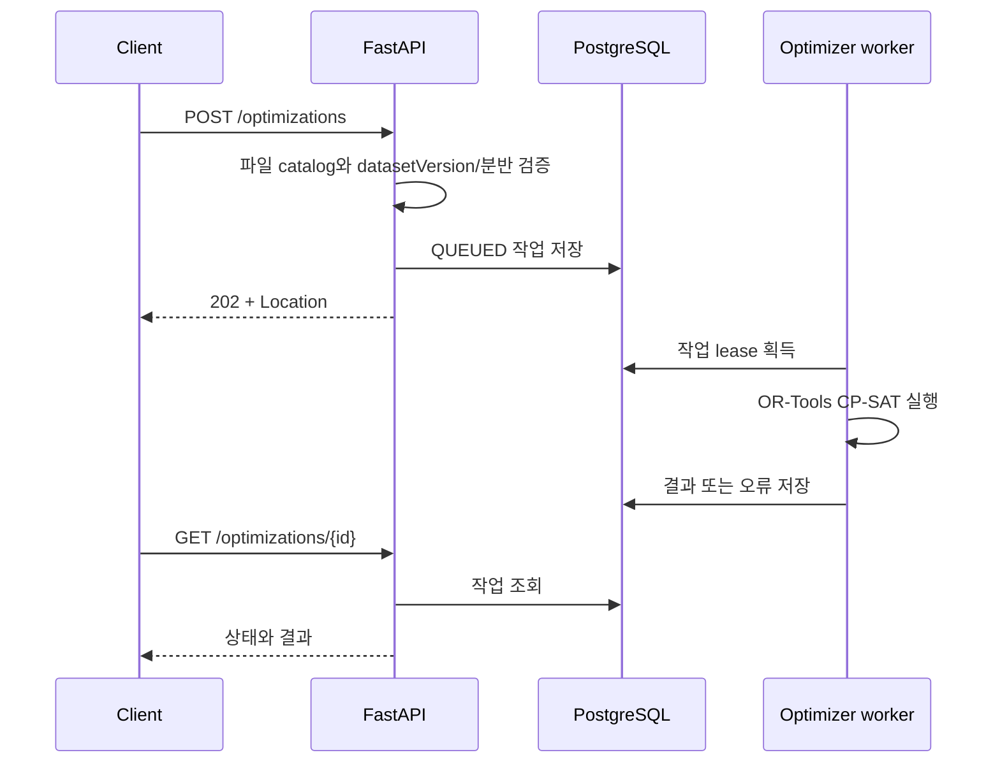

# PL-timeTabler API 명세

이 문서는 PL-timeTabler HTTP API의 사람이 읽기 쉬운 계약서다. 기계 판독 가능한
OpenAPI 3.1 원본은 [`contracts/openapi.json`](../contracts/openapi.json)이며, 구현과
충돌할 경우 OpenAPI snapshot과 FastAPI 라우트가 기준이다.

PostgreSQL 테이블·관계·제약조건은 [`ERD.md`](ERD.md)에 별도로 정리한다.

## 1. API와 저장소 경계

PostgreSQL과 파일 snapshot을 함께 사용한다. PostgreSQL을 사용하지 않는 구조가
아니며, 데이터 성격에 따라 저장 위치를 분리한다.

```text
                            ┌─ data/manifest.json
GET /semesters              ├─ data/courses/*.json
GET /catalog/{semester} ────┴─ data/classrooms/*.json
              │
              └─ datasetVersion 검증
                         │
POST /optimizations ─────┴─> PostgreSQL optimization_jobs
                                      ↑            ↓
                                      └─ optimizer worker

/auth/* ─────────────────────> PostgreSQL auth_* tables
```

| 데이터 | 저장 위치 | 이유 |
| --- | --- | --- |
| 개설과목·분반·강의실 | 버전 관리 JSON snapshot | 배포 단위가 고정되고 읽기 중심인 공개 데이터 |
| 최적화 요청·상태·결과 | PostgreSQL `optimization_jobs` | API와 worker 사이의 내구성 있는 작업 큐 |
| OTP·로그인 세션·인증 제한 이벤트 | PostgreSQL `auth_*` | 만료·폐기·동시성 제어가 필요한 상태 |
| 개인 시간표·프로필 | 브라우저 저장소 | 로그인 없이 편집하고 개인정보 서버 저장을 최소화 |
| 시간표 공유 | URL payload | 현재 서버 공유 테이블을 만들지 않음 |

DB에는 미래의 DB 기반 카탈로그를 위한 `semesters`, `courses`, `sections`, `sessions`,
`rooms`, `data_imports` 테이블도 존재한다. 현재 API는 이 테이블을 조회하지 않으며
검증된 파일 snapshot을 직접 읽는다.

## 2. 공통 규칙

| 항목 | 계약 |
| --- | --- |
| API 버전 | `0.1.0` |
| API prefix | `/api/v1` |
| 요청·응답 형식 | `application/json`, 단 `204 No Content` 제외 |
| JSON 필드명 | `camelCase` |
| 알 수 없는 JSON body 필드 | 허용하지 않음 (`422`) |
| 날짜·시간 | RFC 3339 date-time 문자열 |
| 수업 시간 | 자정부터 경과한 분, `0 <= startMinute < endMinute <= 1440` |
| 요일 | `월`, `화`, `수`, `목`, `금`, `토`, `일` |
| 인증 | 핵심 카탈로그·최적화 API에는 로그인 불필요 |

로컬 Compose 기본 진입점은 `http://127.0.0.1:18080`이다. 운영 주소는
`https://timetabler.kdhoon.me`이며 아래 예시는 경로만 표기한다.

### 공통 오류 형식

FastAPI 입력 검증 오류는 다음 형식으로 반환한다.

```json
{
  "detail": [
    {
      "loc": ["body", "fieldName"],
      "msg": "오류 설명",
      "type": "오류 유형"
    }
  ]
}
```

도메인 오류는 일반적으로 다음 형태다.

```json
{
  "detail": "오류 설명"
}
```

`detail`은 알려지지 않은 분반 목록처럼 JSON 객체가 될 수도 있다.

## 3. Endpoint 요약

| Method | Path | 성공 | 설명 | 주 저장소 |
| --- | --- | --- | --- | --- |
| `GET` | `/api/v1/health/live` | `200` | API 프로세스 생존 확인 | 없음 |
| `GET` | `/api/v1/health/ready` | `200`, `503` | 카탈로그 파일과 DB 준비 상태 확인 | 파일 + PostgreSQL |
| `GET` | `/api/v1/semesters` | `200` | 제공 학기 목록 | 파일 |
| `GET` | `/api/v1/catalog/{semester}` | `200` | 분반 검색·페이지 조회 | 파일 |
| `POST` | `/api/v1/optimizations` | `202` | 최적화 작업 생성 | PostgreSQL |
| `GET` | `/api/v1/optimizations/{job_id}` | `200` | 작업 상태·결과 조회 | PostgreSQL |
| `DELETE` | `/api/v1/optimizations/{job_id}` | `200` | 대기·실행 작업 취소 요청 | PostgreSQL |
| `POST` | `/api/v1/auth/otp/start` | `202` | 학교 이메일 OTP 발송 요청 | PostgreSQL |
| `POST` | `/api/v1/auth/otp/verify` | `200` | OTP 검증 및 세션 발급 | PostgreSQL |
| `GET` | `/api/v1/auth/session` | `200` | 현재 인증 상태 조회 | PostgreSQL |
| `POST` | `/api/v1/auth/logout` | `204` | 현재 세션 폐기 | PostgreSQL |

## 4. Health API

### `GET /api/v1/health/live`

프로세스가 HTTP 요청을 처리할 수 있는지만 확인한다. DB나 카탈로그 상태는 검사하지
않는다.

```json
{
  "status": "live"
}
```

### `GET /api/v1/health/ready`

카탈로그 snapshot 로딩과 PostgreSQL `SELECT 1`을 각각 검사한다.

**200 Ready**

```json
{
  "status": "ready",
  "catalog": "ready",
  "database": "ready"
}
```

둘 중 하나라도 실패하면 같은 구조로 `503`을 반환하며 실패한 구성 요소는
`unavailable`, 전체 상태는 `not_ready`다.

## 5. Catalog API

### `GET /api/v1/semesters`

현재 배포된 카탈로그 학기와 데이터 버전을 반환한다.

```json
[
  {
    "id": "2026-1",
    "preparedAt": "2026-07-10",
    "datasetVersion": "7c89a022ecbb-631a114ce852",
    "sectionCount": 1576,
    "isActive": true
  }
]
```

`datasetVersion`은 과목 파일과 강의실 파일 checksum을 합성한 값이다. 클라이언트는
최적화 요청에 이 값을 다시 보내 오래된 카탈로그와 새 optimizer 입력이 섞이지 않게
해야 한다.

### `GET /api/v1/catalog/{semester}`

학기의 분반을 검색하고 offset 방식으로 조회한다.

#### Path parameter

| 이름 | 형식 | 설명 |
| --- | --- | --- |
| `semester` | string | 예: `2026-1` |

#### Query parameter

| 이름 | 기본값 | 제약 | 설명 |
| --- | --- | --- | --- |
| `q` | 없음 | 최대 120자 | 과목코드·분반·과목명·교수·이수구분 통합 검색 |
| `category` | 없음 | 최대 200자 | 이수구분 정확히 일치 |
| `course_code` | 없음 | 최대 40자 | 과목코드 정확히 일치 |
| `professor` | 없음 | 최대 100자 | 교수명 부분 검색 |
| `offset` | `0` | 0 이상 | 건너뛸 분반 수 |
| `limit` | `2000` | 1~2000 | 반환할 최대 분반 수 |

요청 예시:

```http
GET /api/v1/catalog/2026-1?q=컴퓨팅&limit=1
```

응답 예시:

```json
{
  "semester": "2026-1",
  "preparedAt": "2026-07-10",
  "datasetVersion": "7c89a022ecbb-631a114ce852",
  "total": 25,
  "offset": 0,
  "limit": 1,
  "sections": [
    {
      "id": "922601-01",
      "courseCode": "922601",
      "sectionCode": "01",
      "name": "AI시대의컴퓨팅사고",
      "professor": "김선경",
      "category": "교양필수",
      "credits": 2.0,
      "rawLectureTime": "화11:30-13:30",
      "sessions": [
        {
          "day": "화",
          "startMinute": 690,
          "endMinute": 810,
          "roomCode": "16406",
          "roomName": "정보 406 정보실습실H",
          "buildingCode": "16",
          "buildingName": "정보전산원"
        }
      ],
      "timeToBeAnnounced": false,
      "roomToBeAnnounced": false,
      "warningCodes": []
    }
  ]
}
```

| 오류 | 의미 |
| --- | --- |
| `404` | 지원하지 않는 학기 |
| `422` | query parameter 형식 또는 범위 오류 |

## 6. Optimization API

최적화는 비동기 작업이다. 생성 요청은 결과를 기다리지 않고 `202`와 작업 객체를
반환한다. 클라이언트는 `Location` 응답 헤더 또는 응답의 `id`로 상태를 조회한다.



### `POST /api/v1/optimizations`

#### 요청

```json
{
  "semester": "2026-1",
  "datasetVersion": "7c89a022ecbb-631a114ce852",
  "requiredCourseCodes": ["922601"],
  "candidateCourseCodes": ["927283", "927284", "927430", "927381", "001022"],
  "excludedCourseCodes": [],
  "lockedSectionIds": ["922601-01"],
  "selectedSectionIds": ["922601-01"],
  "professorConstraints": [
    {
      "courseCode": "927283",
      "professor": "정연희"
    }
  ],
  "minCredits": 12,
  "maxCredits": 18,
  "targetCredits": 18,
  "preferences": {
    "preferredDaysOff": ["금"],
    "avoidBeforeMinute": 540,
    "avoidAfterMinute": 1080,
    "minimizeCampusDays": true,
    "minimizeGapMinutes": true,
    "gapWeightPercent": 50,
    "minimizeChanges": true,
    "maxDailyMinutes": 480,
    "minLunchMinutes": 60
  },
  "candidateCount": 3,
  "seed": 0,
  "timeLimitSeconds": 3
}
```

#### 요청 필드

| 필드 | 필수 | 기본값·제약 | 설명 |
| --- | --- | --- | --- |
| `semester` | 아니오 | `2026-1` | 대상 학기 |
| `datasetVersion` | 예 | 현재 catalog 버전 | stale catalog 방지 |
| `requiredCourseCodes` | 아니오 | `[]`, 중복 불가 | 반드시 포함할 과목 |
| `candidateCourseCodes` | 아니오 | `[]` | 선택 가능한 후보 과목 |
| `excludedCourseCodes` | 아니오 | `[]` | 제외할 과목 |
| `lockedSectionIds` | 아니오 | `[]` | 반드시 유지할 분반 |
| `selectedSectionIds` | 아니오 | `[]` | 현재 시간표 분반; 변경 최소화 기준 |
| `professorConstraints` | 아니오 | `[]`, 과목당 하나 | 과목별 교수 제약 |
| `minCredits` | 아니오 | `12`, 정수 0~30 | 최소 학점 |
| `maxCredits` | 아니오 | `18`, 정수 0~30 | 최대 학점 |
| `targetCredits` | 아니오 | `null`, 정수 0~30 | 최소·최대 범위 안의 목표 학점 |
| `preferences` | 아니오 | 아래 기본값 | 소프트 선호 조건 |
| `candidateCount` | 아니오 | `3`, 1~5 | 생성할 후보 수 |
| `seed` | 아니오 | `0`, 0~2147483647 | 결정론적 solver seed |
| `timeLimitSeconds` | 아니오 | `3`, 0 초과 8 이하 | solver 제한 시간 |

`requiredCourseCodes`와 `excludedCourseCodes`, `candidateCourseCodes`와
`excludedCourseCodes`는 서로 겹칠 수 없다. 잠근 분반이 제외 과목에 속하는 것도
허용하지 않는다.

#### `preferences`

| 필드 | 기본값 | 제약 |
| --- | --- | --- |
| `preferredDaysOff` | `[]` | 요일 중복 불가 |
| `avoidBeforeMinute` | `null` | 0~1439 |
| `avoidAfterMinute` | `null` | 1~1440 |
| `minimizeCampusDays` | `true` | boolean |
| `minimizeGapMinutes` | `true` | boolean |
| `gapWeightPercent` | `50` | 0~100 |
| `minimizeChanges` | `true` | boolean |
| `maxDailyMinutes` | `null` | 1~1440 |
| `minLunchMinutes` | `0` | 0~150 |

#### 202 응답

아래는 `datasetVersion`만 지정하고 나머지 기본값을 사용한 생성 요청의 응답 예시다.

```http
Location: /api/v1/optimizations/550e8400-e29b-41d4-a716-446655440000
```

```json
{
  "id": "550e8400-e29b-41d4-a716-446655440000",
  "status": "QUEUED",
  "request": {
    "semester": "2026-1",
    "datasetVersion": "7c89a022ecbb-631a114ce852",
    "requiredCourseCodes": [],
    "candidateCourseCodes": [],
    "excludedCourseCodes": [],
    "lockedSectionIds": [],
    "selectedSectionIds": [],
    "professorConstraints": [],
    "minCredits": 12,
    "maxCredits": 18,
    "targetCredits": null,
    "preferences": {
      "preferredDaysOff": [],
      "avoidBeforeMinute": null,
      "avoidAfterMinute": null,
      "minimizeCampusDays": true,
      "minimizeGapMinutes": true,
      "gapWeightPercent": 50,
      "minimizeChanges": true,
      "maxDailyMinutes": null,
      "minLunchMinutes": 0
    },
    "candidateCount": 3,
    "seed": 0,
    "timeLimitSeconds": 3.0
  },
  "result": null,
  "errorCode": null,
  "errorMessage": null,
  "cancelRequested": false,
  "attempts": 0,
  "createdAt": "2026-07-14T05:00:00Z",
  "updatedAt": "2026-07-14T05:00:00Z"
}
```

| 오류 | 의미 |
| --- | --- |
| `409` | `datasetVersion`이 현재 catalog와 다름; catalog 새로고침 필요 |
| `422` | 지원하지 않는 학기·분반·교수 조건 또는 요청 검증 실패 |
| `429` | 클라이언트별 요청 제한 초과; `Retry-After` 제공 |
| `503` | 활성 작업 수가 DB 큐 상한에 도달; `Retry-After` 제공 |

### `GET /api/v1/optimizations/{job_id}`

작업의 최신 상태를 반환한다.

상태는 다음 중 하나다.

| 상태 | 의미 |
| --- | --- |
| `QUEUED` | worker 대기 중 |
| `RUNNING` | worker가 lease를 잡고 계산 중 |
| `OPTIMAL` | 최적해 확인 |
| `FEASIBLE` | 제한 시간 안에 유효 후보 생성 |
| `INFEASIBLE` | 조건을 만족하는 시간표 없음 |
| `TIME_LIMIT` | 제한 시간 종료 |
| `FAILED` | 처리 실패 |
| `CANCELLED` | 취소 완료 |

성공한 결과의 `result`는 다음 구조다.

```json
{
  "solverVersion": "string",
  "candidates": [
    {
      "rank": 1,
      "sectionIds": ["922601-01"],
      "metrics": {
        "totalCredits": 18.0,
        "campusDays": 4,
        "gapMinutes": 120,
        "firstClassMinute": 540,
        "lastClassMinute": 1080,
        "targetCreditDeviation": 0.0,
        "unknownTimeSections": 0
      },
      "scoreComponents": {
        "campusDays": 4,
        "gapMinutes": 120
      },
      "changes": [],
      "unmetPreferences": [],
      "explanation": []
    }
  ],
  "reasons": []
}
```

존재하지 않는 작업은 `404`를 반환한다.

### `DELETE /api/v1/optimizations/{job_id}`

- `QUEUED` 작업은 즉시 `CANCELLED`로 변경한다.
- `RUNNING` 작업은 `cancelRequested=true`로 표시하고 worker가 안전하게 중단한다.
- 이미 종료된 작업은 현재 상태를 그대로 반환한다.
- 응답 구조는 `GET`과 같은 `OptimizationJobRead`다.
- 존재하지 않는 작업은 `404`를 반환한다.

## 7. Optional Auth API

인증은 시간표 작성의 선행 조건이 아니다. `TIMETABLER_AUTH_ENABLED=false`이면
`GET /auth/session`이 `available=false`를 반환하고 OTP 검증은 성공하지 않는다.

세션 쿠키 기본 이름은 `__Host-timetabler_session`이며 `Secure`, `HttpOnly`,
`SameSite=Lax`, `Path=/` 속성을 사용한다. 평문 OTP와 평문 세션 토큰은 DB에 저장하지
않고 HMAC digest만 저장한다.

### `POST /api/v1/auth/otp/start`

```json
{
  "studentNumber": "20260001"
}
```

- `studentNumber`: 숫자 6~12자리
- 성공 여부·계정 존재 여부·rate limit 여부를 노출하지 않고 항상 일반화된 `202`
  메시지를 사용한다.

```json
{
  "message": "확인 가능한 경우 학교 이메일로 인증 코드를 전송했습니다."
}
```

### `POST /api/v1/auth/otp/verify`

```json
{
  "studentNumber": "20260001",
  "code": "123456"
}
```

성공하면 세션 쿠키와 함께 다음 응답을 반환한다.

```json
{
  "available": true,
  "authenticated": true,
  "studentNumber": "20260001",
  "expiresAt": "2026-08-13T05:00:00Z"
}
```

잘못되거나 만료된 코드, 비활성화된 인증, rate limit 거부는 계정 상태를 구분하지
않고 `401`로 처리한다.

### `GET /api/v1/auth/session`

현재 쿠키 세션을 확인한다. 인증이 꺼져 있거나 유효한 쿠키가 없으면:

```json
{
  "available": false,
  "authenticated": false,
  "studentNumber": null,
  "expiresAt": null
}
```

유효한 세션이 rotation 주기를 지났으면 응답 과정에서 새 쿠키로 교체한다.

### `POST /api/v1/auth/logout`

현재 세션을 폐기하고 쿠키를 삭제한다. 쿠키가 없어도 멱등적으로 성공하며 응답은
`204 No Content`다.

## 8. OpenAPI와 계약 검증

실행 중인 FastAPI가 제공하는 문서:

| 경로 | 용도 |
| --- | --- |
| `/docs` | Swagger UI |
| `/redoc` | ReDoc |
| `/openapi.json` | 실행 중인 OpenAPI 3.1 문서 |

저장소의 canonical snapshot을 다시 생성하고 검증하려면:

```bash
uv --directory apps/backend run timetabler-openapi
uv --directory apps/backend run pytest tests/test_openapi.py tests/test_api.py
git diff --exit-code contracts/openapi.json
```

API 모델이나 라우트를 변경할 때는 다음을 함께 갱신한다.

1. FastAPI route와 Pydantic 모델
2. `contracts/openapi.json`
3. `apps/web/src/api/schema.d.ts`
4. 관련 backend·web 계약 테스트
5. 이 문서의 사람이 읽는 설명과 예시
