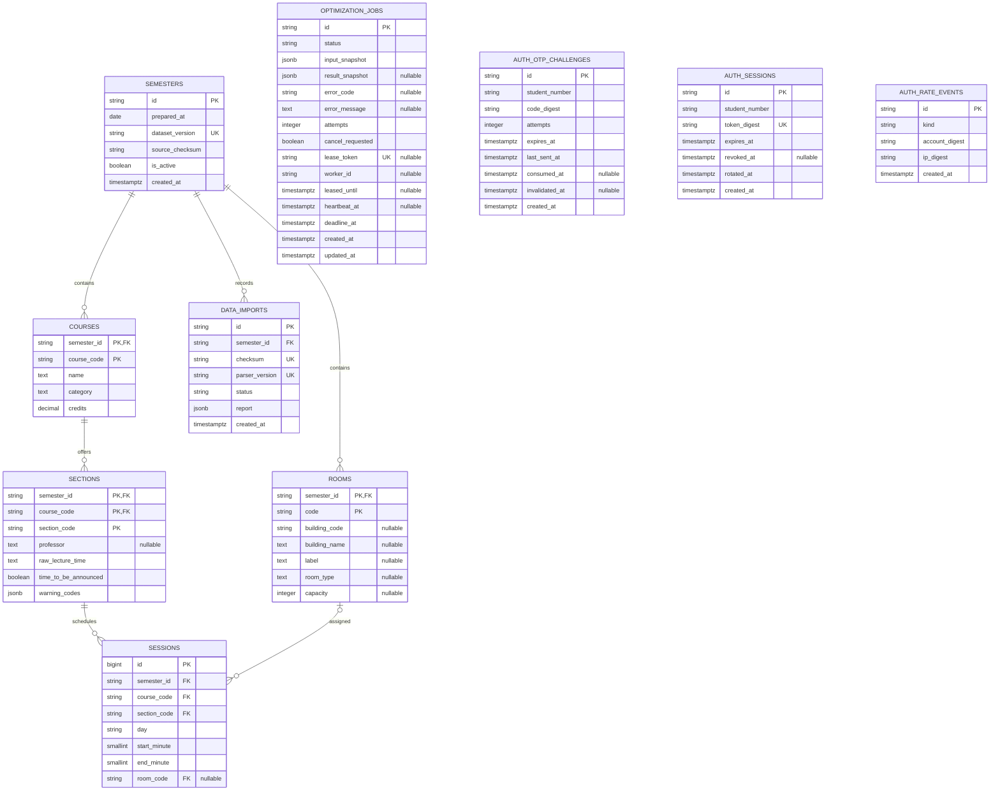

# PL-timeTabler PostgreSQL ERD

이 문서는 PL-timeTabler의 **실제 PostgreSQL 스키마**를 나타낸다. 기준 migration은
Alembic `20260710_0003`이며, 시스템용 `alembic_version` 테이블은 ERD에서 제외한다.

브라우저에서 확대·축소하며 볼 수 있는 버전은 [`ERD.html`](ERD.html)이다.

저장소 루트에서 다음처럼 열 수 있다.

```bash
python3 -m http.server 8088 --directory docs
# http://127.0.0.1:8088/ERD.html
```

API별 저장 위치와 HTTP 계약은 [`API_SPEC.md`](API_SPEC.md), 서비스 경계와 배포 구조는
[`ARCHITECTURE.md`](ARCHITECTURE.md)를 참고한다.

## 1. 전체 ERD



## 2. 관계와 삭제 규칙

| 부모 | 자식 | FK | Cardinality | 삭제 규칙 |
| --- | --- | --- | --- | --- |
| `semesters` | `courses` | `courses.semester_id → semesters.id` | 1:N | `CASCADE` |
| `semesters` | `rooms` | `rooms.semester_id → semesters.id` | 1:N | `CASCADE` |
| `semesters` | `data_imports` | `data_imports.semester_id → semesters.id` | 1:N | `CASCADE` |
| `courses` | `sections` | `(semester_id, course_code)` | 1:N | `CASCADE` |
| `sections` | `sessions` | `(semester_id, course_code, section_code)` | 1:N | `CASCADE` |
| `rooms` | `sessions` | `(semester_id, room_code)` | 1:N, session 측 선택 | `NO ACTION` |

`optimization_jobs`와 인증 테이블은 다른 테이블을 참조하지 않는 독립적인 운영
테이블이다. `auth_otp_challenges.student_number`와 `auth_sessions.student_number`는 같은
사용자를 나타내는 논리적 식별자지만, 현재 `users` 테이블이 없으므로 FK 관계는 아니다.

## 3. 영역별 역할

### 강의 카탈로그 스키마

```text
semesters
 ├─ courses
 │   └─ sections
 │       └─ sessions
 ├─ rooms ─────────┘
 └─ data_imports
```

- `semesters`: 학기와 dataset 버전의 root
- `courses`: 학기별 교과목 기본 정보
- `sections`: 교과목의 분반과 교수·시간 미정 상태
- `sessions`: 분반을 요일·시작·종료·강의실 단위로 정규화
- `rooms`: 학기별 강의실과 건물 정보
- `data_imports`: 같은 원본을 중복 처리하지 않기 위한 import 이력

### 최적화 작업 큐

`optimization_jobs`는 FastAPI와 OR-Tools worker 사이의 내구성 있는 작업 큐다.

- `input_snapshot`: 생성 시점의 최적화 요청 전체
- `result_snapshot`: 후보와 계산 결과
- `status`: `QUEUED`, `RUNNING` 또는 종료 상태
- `lease_token`, `leased_until`, `heartbeat_at`: worker 점유와 장애 복구
- `deadline_at`: 실행 기한
- `cancel_requested`: 실행 중인 작업의 협력적 취소 신호

요청과 결과를 `jsonb` snapshot으로 보관하므로 카탈로그 테이블과 FK를 맺지 않는다.
대신 API가 작업 생성 전에 파일 카탈로그의 `datasetVersion`과 분반 ID를 검증한다.

### 선택형 인증

- `auth_otp_challenges`: OTP digest, 시도 횟수, 만료·소비·무효화 상태
- `auth_sessions`: 세션 토큰 digest, 만료·폐기·회전 상태
- `auth_rate_events`: 계정·IP digest별 OTP 요청 제한 이벤트

평문 OTP, 평문 세션 토큰과 원본 IP는 DB에 저장하지 않는다.

## 4. 주요 제약조건과 인덱스

### Unique 제약조건

| 테이블 | 컬럼 |
| --- | --- |
| `semesters` | `dataset_version` |
| `data_imports` | `(semester_id, checksum, parser_version)` |
| `optimization_jobs` | `lease_token` |
| `auth_sessions` | `token_digest` |

### Check 제약조건

`sessions`는 다음 시간 규칙을 DB에서도 강제한다.

```text
0 <= start_minute < 1440
start_minute < end_minute <= 1440
day IN ('월', '화', '수', '목', '금', '토', '일')
```

### 조회·정리 인덱스

| 인덱스 | 컬럼 | 용도 |
| --- | --- | --- |
| `ix_sessions_section` | `(semester_id, course_code, section_code)` | 분반별 세션 조회 |
| `ix_optimization_jobs_status` | `status` | 상태별 작업 조회 |
| `ix_optimization_jobs_claim` | `(status, leased_until, created_at)` | 다음 작업 점유 |
| `ix_auth_otp_challenges_student_created` | `(student_number, created_at)` | 최근 OTP 조회 |
| `ix_auth_otp_challenges_created` | `created_at` | 보존기간 정리 |
| `ix_auth_sessions_student` | `student_number` | 사용자 세션 조회 |
| `ix_auth_sessions_token_digest` | `token_digest`, unique | 쿠키 세션 조회 |
| `ix_auth_sessions_expires` | `expires_at` | 만료 세션 정리 |
| `ix_auth_sessions_revoked` | `revoked_at` | 폐기 세션 정리 |
| `ix_auth_rate_events_account` | `(kind, account_digest, created_at)` | 계정별 rate limit |
| `ix_auth_rate_events_ip` | `(kind, ip_digest, created_at)` | IP별 rate limit |

복합 PK와 unique 제약조건이 생성하는 PostgreSQL 인덱스는 표에서 생략했다.

## 5. 현재 런타임에서 실제 사용하는 데이터

스키마가 존재하는 것과 API가 그 테이블을 읽는 것은 구분해야 한다.

| 기능 | 현재 source of truth | PostgreSQL 사용 |
| --- | --- | --- |
| 학기·분반·강의실 조회 | `data/`의 versioned JSON snapshot | 현재 조회하지 않음 |
| 최적화 생성·조회·취소 | `optimization_jobs` | 사용 |
| optimizer worker 처리 결과 | `optimization_jobs` | 사용 |
| 선택형 OTP·로그인 | `auth_*` | 인증 활성화 시 사용 |
| 개인 시간표·프로필 | 브라우저 저장소 | 사용하지 않음 |

따라서 현재 구조를 “파일 DB만 사용한다” 또는 “모든 데이터를 PostgreSQL에 저장한다”로
설명하면 둘 다 부정확하다. **공개 정적 카탈로그는 파일, 서버 상태는 PostgreSQL**이라는
혼합 구조다.

`academic_units`, `curriculum_versions`, `requirement_rules`, `draft_timetables`,
`optimization_candidates` 등 아키텍처 문서의 확장 후보는 현재 migration에 없으므로
이 ERD에 포함하지 않는다.

## 6. 스키마 변경 절차

운영 PostgreSQL은 Alembic migration만으로 생성·변경한다. `Base.metadata.create_all()`은
격리된 API 테스트용이며 운영 스키마 관리 수단이 아니다.

스키마를 변경할 때는 다음을 함께 갱신한다.

1. `migrations/versions/` 아래 Alembic migration
2. 사용하는 테이블의 SQLAlchemy model
3. migration·repository·service 테스트
4. 이 ERD의 컬럼·관계·제약조건
5. 저장 경계가 바뀌면 `API_SPEC.md`와 `ARCHITECTURE.md`
