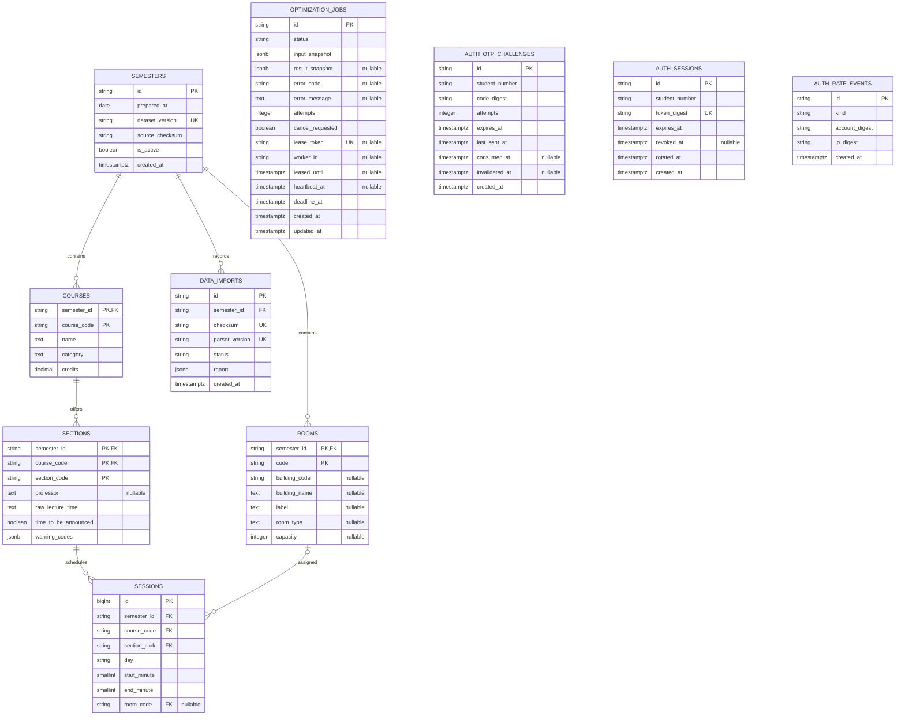

# PL-timeTabler PostgreSQL ERD

이 문서는 PL-timeTabler의 **실제 PostgreSQL 스키마**를 나타낸다. 기준 migration은
Alembic `20260718_0007`이며, 시스템용 `alembic_version` 테이블은 ERD에서 제외한다.
현재 `public` schema의 애플리케이션 테이블 44개를 아래 영역별 구조와 관계 표에서 모두
다룬다.

핵심 카탈로그·인증 구조를 브라우저에서 확대·축소하며 볼 수 있는 버전은
[`ERD.html`](ERD.html)이다. 전체 관계형 구조의 기준은 이 문서다.

저장소 루트에서 다음처럼 열 수 있다.

```bash
python3 -m http.server 8088 --directory docs
# http://127.0.0.1:8088/ERD.html
```

API별 저장 위치와 HTTP 계약은 [`API_SPEC.md`](API_SPEC.md), 서비스 경계와 배포 구조는
[`ARCHITECTURE.md`](ARCHITECTURE.md)를 참고한다.

## 1. 핵심 ERD



## 2. 관계와 삭제 규칙

| 부모 | 자식 | FK | Cardinality | 삭제 규칙 |
| --- | --- | --- | --- | --- |
| `semesters` | `courses` | `courses.semester_id → semesters.id` | 1:N | `CASCADE` |
| `semesters` | `rooms` | `rooms.semester_id → semesters.id` | 1:N | `CASCADE` |
| `semesters` | `data_imports` | `data_imports.semester_id → semesters.id` | 1:N | `CASCADE` |
| `courses` | `sections` | `(semester_id, course_code)` | 1:N | `CASCADE` |
| `sections` | `sessions` | `(semester_id, course_code, section_code)` | 1:N | `CASCADE` |
| `rooms` | `sessions` | `(semester_id, room_code)` | 1:N, session 측 선택 | `NO ACTION` |
| `historical_term_datasets` | `historical_course_offerings` | `dataset_id` | 1:N | `CASCADE` |
| `historical_curriculum_datasets` | `historical_curriculum_departments` | `dataset_id` | 1:N | `CASCADE` |
| `historical_relation_datasets` | `historical_course_relations` | `dataset_id` | 1:N | `CASCADE` |
| `requirement_datasets` | `curriculum_program_requirements` | `dataset_id` | 1:N | `CASCADE` |
| `curriculum_program_requirements` | `curriculum_program_aliases` | `program_id` | 1:N | `CASCADE` |
| `curriculum_program_requirements` | `curriculum_required_courses` | `program_id` | 1:N | `CASCADE` |
| `requirement_datasets` | `graduation_requirement_rules` | `dataset_id` | 1:N | `CASCADE` |
| `requirement_datasets` | `graduation_liberal_requirement_sets` | `dataset_id` | 1:N | `CASCADE` |
| `requirement_datasets` | `graduation_credit_profiles` | `dataset_id` | 1:N | `CASCADE` |
| `graduation_liberal_requirement_sets` | `graduation_credit_profiles` | `liberal_requirement_set_id` | 1:N | `RESTRICT` |
| `graduation_liberal_requirement_sets` | `graduation_liberal_required_courses` | `requirement_set_id` | 1:N | `CASCADE` |
| `graduation_liberal_requirement_sets` | `graduation_liberal_area_requirements` | `requirement_set_id` | 1:N | `CASCADE` |
| `graduation_liberal_required_courses` | `graduation_liberal_course_aliases` | `course_id` | 1:N | `CASCADE` |
| `graduation_liberal_required_courses` | `graduation_liberal_course_terms` | `course_id` | 1:N | `CASCADE` |
| `graduation_credit_profiles` | `graduation_credit_profile_source_refs` | `profile_id` | 1:N | `CASCADE` |
| `graduation_credit_profiles` | `graduation_credit_profile_academic_unit_aliases` | `profile_id` | 1:N | `CASCADE` |
| `graduation_credit_profiles` | `graduation_credit_profile_warnings` | `profile_id` | 1:N | `CASCADE` |
| `requirement_datasets` | `graduation_assessment_profiles` | `dataset_id` | 1:N | `CASCADE` |
| `graduation_assessment_profiles` | `graduation_assessment_source_refs` | `profile_id` | 1:N | `CASCADE` |
| `graduation_assessment_profiles` | `graduation_assessment_categories` | `profile_id` | 1:N | `CASCADE` |
| `graduation_assessment_profiles` | `graduation_assessment_credentials` | `profile_id` | 1:N | `CASCADE` |
| `requirement_datasets` | `graduation_legacy_requirements` | `dataset_id` | 1:N | `CASCADE` |
| `graduation_legacy_requirements` | `graduation_legacy_source_refs` | `legacy_requirement_id` | 1:N | `CASCADE` |
| `graduation_legacy_requirements` | `graduation_legacy_cohorts` | `legacy_requirement_id` | 1:N | `CASCADE` |
| `users` | `privacy_consents` | `user_id` | 1:N | `CASCADE` |
| `users` | `saved_timetables` | `user_id` | 1:N | `CASCADE` |
| `users` | `course_reviews` | `user_id` | 1:N | `CASCADE` |
| `users` | `completed_courses` | `user_id` | 1:N | `CASCADE` |
| `users` | `timetable_shares` | `created_by` | 1:N | `CASCADE` |
| `saved_timetables` | `timetable_shares` | `timetable_id` | 1:N | `CASCADE` |
| `historical_course_offerings` | `completed_courses` | `historical_offering_id` | 1:N, completed course 측 선택 | `SET NULL` |

`optimization_jobs`와 인증 테이블은 FK를 두지 않는 독립적인 운영 테이블이다.
`auth_otp_challenges.student_number`, `auth_sessions.student_number`,
`users.student_number`는 같은 사용자를 나타내는 논리적 식별자지만 인증 challenge와
세션 정리를 계정 삭제와 분리하기 위해 FK 관계로 묶지 않는다. `privacy_consents`,
`saved_timetables`, `course_reviews`, `completed_courses`, `timetable_shares`는 `users.id`를
`CASCADE`로 참조한다.

## 3. 영역별 역할

### 강의 카탈로그 스키마

```text
semesters
 ├─ courses
 │   └─ sections
 │       └─ sessions
 ├─ rooms ─────────┘
 └─ data_imports
```

- `semesters`: 학기와 dataset 버전의 root
- `courses`: 학기별 교과목 기본 정보
- `sections`: 교과목의 분반과 교수·시간 미정 상태
- `sessions`: 분반을 요일·시작·종료·강의실 단위로 정규화
- `rooms`: 학기별 강의실과 건물 정보
- `data_imports`: 같은 원본을 중복 처리하지 않기 위한 import 이력

### 최적화 작업 큐

`optimization_jobs`는 FastAPI와 OR-Tools worker 사이의 내구성 있는 작업 큐다.

- `input_snapshot`: 생성 시점의 최적화 요청 전체
- `result_snapshot`: 후보와 계산 결과
- `status`: `QUEUED`, `RUNNING` 또는 종료 상태
- `lease_token`, `leased_until`, `heartbeat_at`: worker 점유와 장애 복구
- `deadline_at`: 실행 기한
- `cancel_requested`: 실행 중인 작업의 협력적 취소 신호

요청과 결과를 `jsonb` snapshot으로 보관하므로 카탈로그 테이블과 FK를 맺지 않는다.
대신 API가 작업 생성 전에 파일 카탈로그의 `datasetVersion`과 분반 ID를 검증한다.

### 선택형 인증

- `auth_otp_challenges`: OTP digest, 시도 횟수, 만료·소비·무효화 상태
- `auth_sessions`: 세션 토큰 digest, 만료·폐기·회전 상태
- `auth_rate_events`: 계정·IP digest별 OTP 요청 제한 이벤트

평문 OTP, 평문 세션 토큰과 원본 IP는 DB에 저장하지 않는다.

### 사용자 소유 데이터와 공유

```text
users
 ├─ privacy_consents
 ├─ saved_timetables ── timetable_shares
 ├─ course_reviews
 └─ completed_courses ── historical_course_offerings (선택 참조)
```

- `users`: 학번 기반 프로필과 졸업요건 판정에 필요한 입학연도·학생유형·전공경로
- `privacy_consents`: 동의 버전·동의 여부·시각 이력
- `saved_timetables`: 시간표 항목과 최적화 선호 snapshot
- `timetable_shares`: 저장 시간표를 가리키는 만료 가능한 공유 코드
- `course_reviews`: 사용자별 과목·교수·학기 리뷰
- `completed_courses`: 수동 입력 또는 역사 분반에서 연결한 개인 이수내역. 원본 역사
  분반이 삭제되어도 `source_snapshot`은 보존한다.

### 역사 아카이브

```text
historical_archive_manifests
historical_term_datasets ── historical_course_offerings
historical_curriculum_datasets ── historical_curriculum_departments
historical_relation_datasets ── historical_course_relations
```

- `historical_archive_manifests`: 전체 아카이브 manifest와 원본 압축본
- `historical_term_datasets`, `historical_course_offerings`: 학기 원본과 검색 가능한 분반
- `historical_curriculum_datasets`, `historical_curriculum_departments`: 연도별 교육과정
  원본과 학과 단위 레코드
- `historical_relation_datasets`, `historical_course_relations`: 대체·동일과목 원본과
  검색 가능한 관계 레코드

### 교육과정·졸업요건 정규화

```mermaid
erDiagram
    REQUIREMENT_DATASETS ||--o{ CURRICULUM_PROGRAM_REQUIREMENTS : contains
    CURRICULUM_PROGRAM_REQUIREMENTS ||--o{ CURRICULUM_PROGRAM_ALIASES : names
    CURRICULUM_PROGRAM_REQUIREMENTS ||--o{ CURRICULUM_REQUIRED_COURSES : requires
    REQUIREMENT_DATASETS ||--o{ GRADUATION_REQUIREMENT_RULES : preserves
    REQUIREMENT_DATASETS ||--o{ GRADUATION_LIBERAL_REQUIREMENT_SETS : owns
    REQUIREMENT_DATASETS ||--o{ GRADUATION_CREDIT_PROFILES : owns
    GRADUATION_LIBERAL_REQUIREMENT_SETS ||--o{ GRADUATION_CREDIT_PROFILES : shared_by
    GRADUATION_LIBERAL_REQUIREMENT_SETS ||--o{ GRADUATION_LIBERAL_REQUIRED_COURSES : requires
    GRADUATION_LIBERAL_REQUIREMENT_SETS ||--o{ GRADUATION_LIBERAL_AREA_REQUIREMENTS : requires
    GRADUATION_LIBERAL_REQUIRED_COURSES ||--o{ GRADUATION_LIBERAL_COURSE_ALIASES : names
    GRADUATION_LIBERAL_REQUIRED_COURSES ||--o{ GRADUATION_LIBERAL_COURSE_TERMS : offered
    GRADUATION_CREDIT_PROFILES ||--o{ GRADUATION_CREDIT_PROFILE_SOURCE_REFS : cites
    GRADUATION_CREDIT_PROFILES ||--o{ GRADUATION_CREDIT_PROFILE_ACADEMIC_UNIT_ALIASES : names
    GRADUATION_CREDIT_PROFILES ||--o{ GRADUATION_CREDIT_PROFILE_WARNINGS : flags
    REQUIREMENT_DATASETS ||--o{ GRADUATION_ASSESSMENT_PROFILES : owns
    GRADUATION_ASSESSMENT_PROFILES ||--o{ GRADUATION_ASSESSMENT_SOURCE_REFS : cites
    GRADUATION_ASSESSMENT_PROFILES ||--o{ GRADUATION_ASSESSMENT_CATEGORIES : contains
    GRADUATION_ASSESSMENT_PROFILES ||--o{ GRADUATION_ASSESSMENT_CREDENTIALS : contains
    REQUIREMENT_DATASETS ||--o{ GRADUATION_LEGACY_REQUIREMENTS : owns
    GRADUATION_LEGACY_REQUIREMENTS ||--o{ GRADUATION_LEGACY_SOURCE_REFS : cites
    GRADUATION_LEGACY_REQUIREMENTS ||--o{ GRADUATION_LEGACY_COHORTS : mentions

    REQUIREMENT_DATASETS {
        string id PK
        string kind
        integer admission_year "nullable"
        integer effective_year "nullable"
        date as_of "nullable"
        string source_checksum
        string normalized_checksum
        jsonb raw_payload
    }
    CURRICULUM_PROGRAM_REQUIREMENTS {
        string id PK
        string dataset_id FK
        integer admission_year
        string academic_unit
        string academic_unit_key
        string status
        jsonb source_locators
    }
    CURRICULUM_PROGRAM_ALIASES {
        string id PK
        string program_id FK
        integer admission_year
        string alias
        string alias_key
        boolean is_primary
    }
    CURRICULUM_REQUIRED_COURSES {
        string id PK
        string program_id FK
        string classification
        string course_code
        string course_name
        float credits "nullable"
        integer grade "nullable"
        jsonb semesters
        jsonb source_locator
    }
    GRADUATION_REQUIREMENT_RULES {
        string id PK
        string dataset_id FK
        string rule_kind
        string academic_unit_key "nullable"
        integer admission_year_start "nullable"
        integer admission_year_end "nullable"
        boolean requires_manual_review
        jsonb raw_payload
    }
    GRADUATION_LIBERAL_REQUIREMENT_SETS {
        string id PK
        string dataset_id FK
        string signature UK
        integer admission_year
        string student_type
        integer total_credits_min
        integer total_credits_max "nullable"
    }
    GRADUATION_LIBERAL_REQUIRED_COURSES {
        string id PK
        string requirement_set_id FK
        integer position
        string course_code "nullable"
        string course_name
        integer credits
    }
    GRADUATION_LIBERAL_COURSE_ALIASES {
        string id PK
        string course_id FK
        integer position
        string alias
        string alias_key
    }
    GRADUATION_LIBERAL_COURSE_TERMS {
        string course_id PK, FK
        integer semester PK
    }
    GRADUATION_LIBERAL_AREA_REQUIREMENTS {
        string id PK
        string requirement_set_id FK
        integer position
        string area
        integer min_courses
        integer min_credits "nullable"
    }
    GRADUATION_CREDIT_PROFILES {
        string id PK
        string dataset_id FK
        string liberal_requirement_set_id FK
        string academic_unit_key
        integer admission_year
        string student_type
        string program_path
        integer total_credits_min
        integer primary_major_min
    }
    GRADUATION_CREDIT_PROFILE_SOURCE_REFS {
        string profile_id PK, FK
        integer position PK
        text source_ref
    }
    GRADUATION_CREDIT_PROFILE_ACADEMIC_UNIT_ALIASES {
        string profile_id PK, FK
        integer position PK
        string alias
        string alias_key
    }
    GRADUATION_CREDIT_PROFILE_WARNINGS {
        string id PK
        string profile_id FK
        integer position
        string code
        integer calculated
        integer printed
    }
    GRADUATION_ASSESSMENT_PROFILES {
        string id PK
        string dataset_id FK
        integer effective_year
        string academic_unit_key
        string transition_mode
        boolean requires_manual_review
    }
    GRADUATION_ASSESSMENT_SOURCE_REFS {
        string profile_id PK, FK
        integer position PK
        text source_ref
    }
    GRADUATION_ASSESSMENT_CATEGORIES {
        string id PK
        string profile_id FK
        string category_code
        text requirement_detail "nullable"
    }
    GRADUATION_ASSESSMENT_CREDENTIALS {
        string id PK
        string profile_id FK
        integer position
        text foreign_language "nullable"
    }
    GRADUATION_LEGACY_REQUIREMENTS {
        string id PK
        string dataset_id FK
        integer effective_year
        string academic_unit_key
        text pass_requirement "nullable"
        boolean requires_manual_review
    }
    GRADUATION_LEGACY_SOURCE_REFS {
        string legacy_requirement_id PK, FK
        integer position PK
        text source_ref
    }
    GRADUATION_LEGACY_COHORTS {
        string id PK
        string legacy_requirement_id FK
        integer position
        integer start_year "nullable"
        integer end_year "nullable"
        string expression
    }
```



- `requirement_datasets`: 원본·정규화 checksum과 기준연도를 가진 멱등 import root
- `curriculum_program_requirements`: 2016~2026 입학연도별 원문 교육과정 단위
- `curriculum_program_aliases`: 학과·학부·전공 명칭과 검수 별칭을 연도별 검색 키로 보존
- `curriculum_required_courses`: 전공기초(`전기`)·전공필수(`전필`) 과목과 학년·학기·출처 위치
- `graduation_requirement_rules`: 공통 규칙과 원문별 421개 보존·추적 행. 계산용 890개
  정규 프로필은 이 테이블의 JSON을 읽지 않는다.
- `graduation_liberal_requirement_sets`와 하위 과목·별칭·학기·영역 테이블: 789개
  프로필에 반복되던 15개 교양요건 조합을 공유한다.
- `graduation_credit_profiles`: 학과·입학연도·학생유형·전공경로별 789개 정량 학점 요건과
  원문 범위를 그대로 보존하는 793개 프로필별 학과명 행
- `graduation_assessment_profiles`와 하위 category·credential: 66개 학과 프로필과
  264개 심사 범주·42개 자격 상세
- `graduation_legacy_requirements`와 `graduation_legacy_cohorts`: 35개 기존 학과별
  자유서술 요건과 6개 적용 학번 범위
- 각 `*_source_refs` 테이블: 순서가 있는 다중 출처. 계산 테이블에는 중복
  `raw_payload`를 두지 않고 원문 bundle은 dataset checksum과 파일 snapshot으로 보존한다.

## 4. 주요 제약조건과 인덱스

### Unique 제약조건

| 테이블 | 컬럼 |
| --- | --- |
| `semesters` | `dataset_version` |
| `data_imports` | `(semester_id, checksum, parser_version)` |
| `optimization_jobs` | `lease_token` |
| `auth_sessions` | `token_digest` |
| `curriculum_program_requirements` | `(dataset_id, academic_unit_key)` |
| `curriculum_program_aliases` | `(admission_year, alias_key, program_id)` |
| `curriculum_required_courses` | `(program_id, classification, course_code)` |
| `graduation_liberal_requirement_sets` | `(dataset_id, signature)` |
| `graduation_credit_profiles` | `(dataset_id, academic_unit_key, admission_year, student_type, program_path)` |
| `graduation_assessment_profiles` | `(dataset_id, academic_unit_key, effective_year)` |
| 각 `*_source_refs` | 부모 ID와 `position`, 부모 ID와 `source_ref` |
| `graduation_credit_profile_academic_unit_aliases` | 부모 ID와 `position`, 부모 ID와 `alias_key` |

### Check 제약조건

`sessions`는 다음 시간 규칙을 DB에서도 강제한다.

```text
0 <= start_minute < 1440
start_minute < end_minute <= 1440
day IN ('월', '화', '수', '목', '금', '토', '일')
```

졸업요건 테이블은 입학·시행연도 범위, 음수 학점 금지, 교양 상한/하한 순서,
전공경로 enum, 심사 category·transition mode enum, 학기 `IN (1, 2)`, 학번 범위 순서를
check constraint로 강제한다.

### 조회·정리 인덱스

| 인덱스 | 컬럼 | 용도 |
| --- | --- | --- |
| `ix_sessions_section` | `(semester_id, course_code, section_code)` | 분반별 세션 조회 |
| `ix_optimization_jobs_status` | `status` | 상태별 작업 조회 |
| `ix_optimization_jobs_claim` | `(status, leased_until, created_at)` | 다음 작업 점유 |
| `ix_auth_otp_challenges_student_created` | `(student_number, created_at)` | 최근 OTP 조회 |
| `ix_auth_otp_challenges_created` | `created_at` | 보존기간 정리 |
| `ix_auth_sessions_student` | `student_number` | 사용자 세션 조회 |
| `ix_auth_sessions_token_digest` | `token_digest`, unique | 쿠키 세션 조회 |
| `ix_auth_sessions_expires` | `expires_at` | 만료 세션 정리 |
| `ix_auth_sessions_revoked` | `revoked_at` | 폐기 세션 정리 |
| `ix_auth_rate_events_account` | `(kind, account_digest, created_at)` | 계정별 rate limit |
| `ix_auth_rate_events_ip` | `(kind, ip_digest, created_at)` | IP별 rate limit |
| `ix_requirement_datasets_kind_year` | `(kind, admission_year, effective_year)` | 자료 종류·기준연도 조회 |
| `ix_curriculum_program_requirements_year_unit` | `(admission_year, academic_unit_key)` | 입학연도·원문 학과 조회 |
| `ix_curriculum_program_aliases_year_key` | `(admission_year, alias_key)` | 프로필 학과명 매핑 |
| `ix_curriculum_required_courses_program` | `(program_id, classification)` | 학과별 전기·전필 조회 |
| `ix_graduation_requirement_rules_lookup` | `(academic_unit_key, admission_year_start, admission_year_end, effective_year)` | 적용 졸업요건 후보 조회 |
| `ix_graduation_credit_profile_lookup` | `(academic_unit_key, admission_year, student_type, program_path)` | 정량 졸업요건 정확 범위 조회 |
| `ix_graduation_assessment_profile_lookup` | `(academic_unit_key, effective_year)` | 학과별 표준화 심사 조회 |
| `ix_graduation_legacy_requirement_lookup` | `(academic_unit_key, effective_year)` | 학과별 기존 심사 조회 |

복합 PK와 unique 제약조건이 생성하는 PostgreSQL 인덱스는 표에서 생략했다.

## 5. 현재 런타임에서 실제 사용하는 데이터

스키마가 존재하는 것과 API가 그 테이블을 읽는 것은 구분해야 한다.

| 기능 | 현재 source of truth | PostgreSQL 사용 |
| --- | --- | --- |
| 학기·분반·강의실 조회 | `data/`의 versioned JSON snapshot | 현재 조회하지 않음 |
| 2020~2026 역사 강의·강의계획서 조회 | `historical_term_datasets`, `historical_course_offerings` | 사용 |
| 연도별 교육과정·대체/동일과목 원본 | `historical_curriculum_*`, `historical_*relations` | 사용 |
| 2016~2026 입학연도별 전공기초·전공필수 판정 | `curriculum_program_*`, `curriculum_required_courses` | 사용 |
| 2020~2026 학과·학번·전공경로별 정량 졸업요건 | `graduation_credit_profiles`, `graduation_liberal_*` | 사용: 789개 학점 프로필과 공유 교양요건 자동 점검 |
| 학과별 졸업심사 정규화 행 | `graduation_assessment_*`, `graduation_legacy_*` | 사용: 66개 표준화·35개 기존 요건 조회, 자유서술·개인 증빙은 자동 확정 안 함 |
| 공통 규칙·원문별 보존 행 | `graduation_requirement_rules` | 사용: 출처 추적용 421행; 890개 계산 프로필 조회에는 사용하지 않음 |
| 최적화 생성·조회·취소 | `optimization_jobs` | 사용 |
| optimizer worker 처리 결과 | `optimization_jobs` | 사용 |
| 선택형 OTP·로그인 | `auth_*` | 인증 활성화 시 사용 |
| 로그인 프로필·시간표·리뷰·이수내역 | `users`, `saved_timetables`, `course_reviews`, `completed_courses` | 사용 |

따라서 현재 구조를 “파일 DB만 사용한다” 또는 “활성 카탈로그까지 모두 PostgreSQL에서
읽는다”로 설명하면 둘 다 부정확하다. **현재 학기 최적화 카탈로그는 파일, 무손실 역사
아카이브와 계정 상태는 PostgreSQL**이라는 혼합 구조다.

### 역사 아카이브 관계

```text
historical_archive_manifests
historical_term_datasets 1 ── N historical_course_offerings 1 ── N completed_courses
historical_curriculum_datasets 1 ── N historical_curriculum_departments
historical_relation_datasets 1 ── N historical_course_relations
```

- 모든 dataset 행은 매니페스트 SHA-256, 원본 gzip 바이트, 루트 메타데이터를 보존한다.
- 각 분반·학과 교육과정·관계 행의 `raw_payload`는 수집 JSON 객체 전체다.
- `completed_courses.historical_offering_id`는 원본 분반을 가리키며 원본 제거 시 `SET NULL`이다. `source_snapshot`은 등록 당시 원본을 계속 보존한다.

`academic_units`, `curriculum_versions`, `draft_timetables`,
`optimization_candidates` 등 아키텍처 문서의 확장 후보는 현재 migration에 없으므로
이 ERD에 포함하지 않는다.

## 6. 스키마 변경 절차

운영 PostgreSQL은 Alembic migration만으로 생성·변경한다. `Base.metadata.create_all()`은
격리된 API 테스트용이며 운영 스키마 관리 수단이 아니다.

스키마를 변경할 때는 다음을 함께 갱신한다.

1. `migrations/versions/` 아래 Alembic migration
2. 사용하는 테이블의 SQLAlchemy model
3. migration·repository·service 테스트
4. 이 ERD의 컬럼·관계·제약조건
5. 저장 경계가 바뀌면 `API_SPEC.md`와 `ARCHITECTURE.md`
